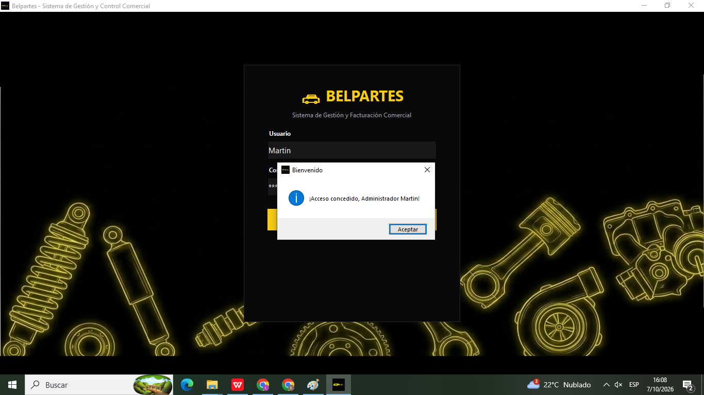
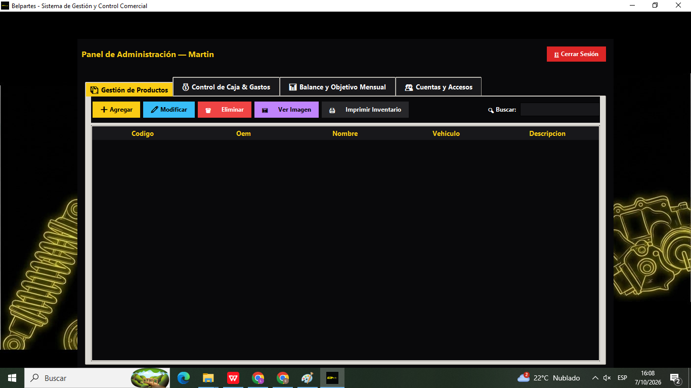
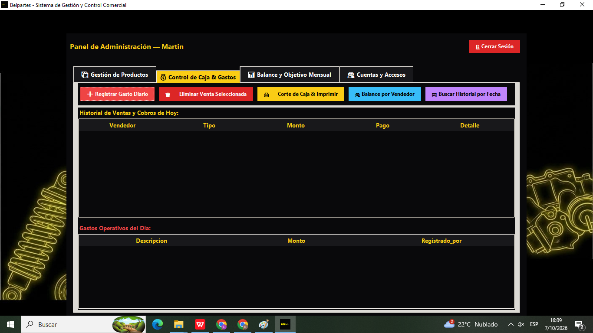
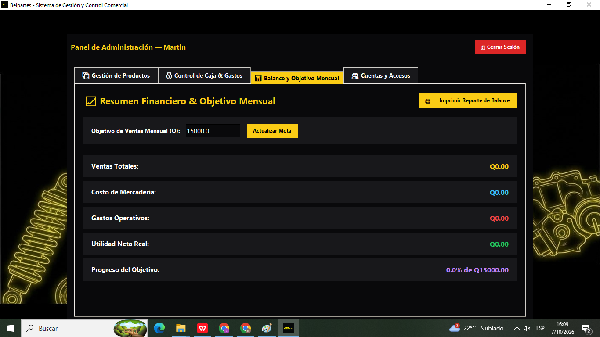
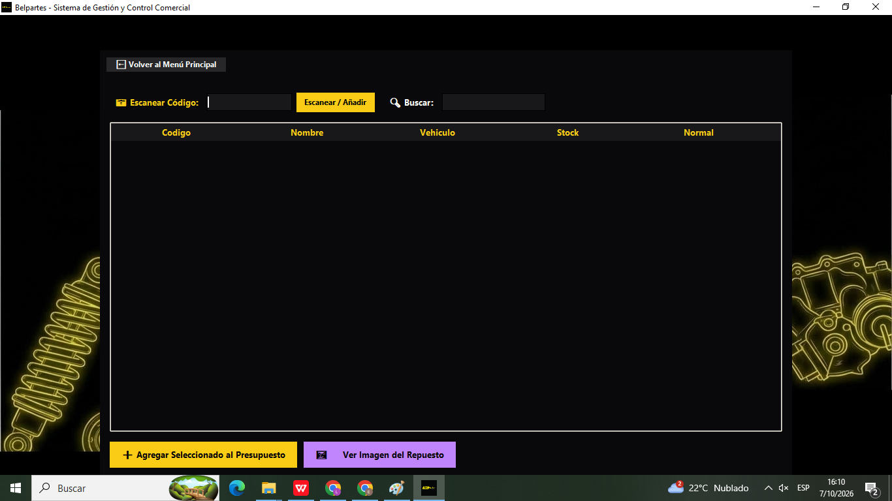
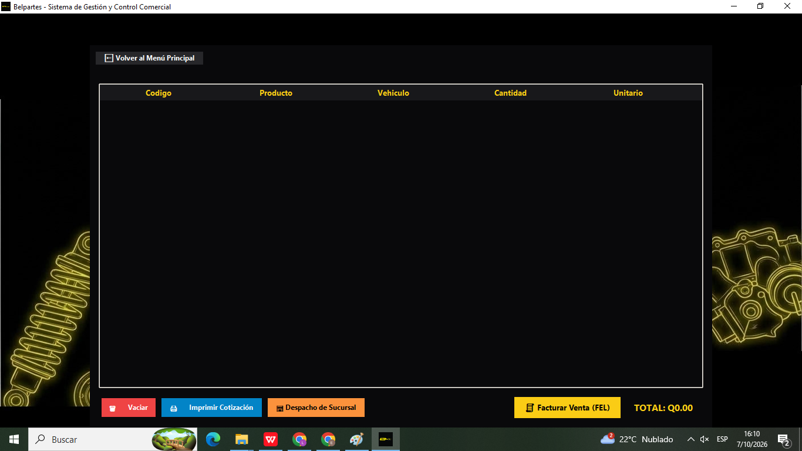

# Belpartes – Management System

Desktop application for managing an auto parts store, built with Python and CustomTkinter on a cloud PostgreSQL database (Supabase).

> Built as a freelance project for Belpartes, with the owner's authorization to showcase it. Source code and business data are not published for confidentiality.

## Results
- Used daily by the whole store plus 5 people
- Saves 1 to 2 hours of manual work every day
- Built in about 10 days, including the cloud database connection

## Features
- **Product management:** inventory with minimum-stock alerts, product images and printable inventory
- **Sales and quotes:** barcode scanner and search, quote builder with printed quotes, and high-volume sales
- **Branch dispatching and invoicing link:** dispatch to branches, and the invoice button opens the company's e-invoicing (FEL) portal
- **Automatic cash closing:** sales are reflected on their own, the administrator only enters expenses
- **Role-based access:** administrator and worker accounts; cost prices are private
- **Monthly balance:** sales, merchandise cost, expenses, net profit and progress toward a monthly goal
- **Reports:** printed cash closings and balance reports

## Tech stack
Python · CustomTkinter · PostgreSQL · Supabase

## Screenshots
Login

Product management

Cash control and expenses

Monthly balance and goal

Worker panel: barcode scan and quote builder

Sales, quotes and branch dispatch

## Currently working on
- A second system for service management: vehicle reception, per-vehicle and per-customer tracking with alerts, and daily cash closings
- Telegram bots to automate daily money-related tasks

## About me
I am Emilio Caceres, a Python developer based in Guatemala looking for remote work. I am happy to walk through the code and architecture in an interview.

Contact: emicaceres1234@gmail.com
